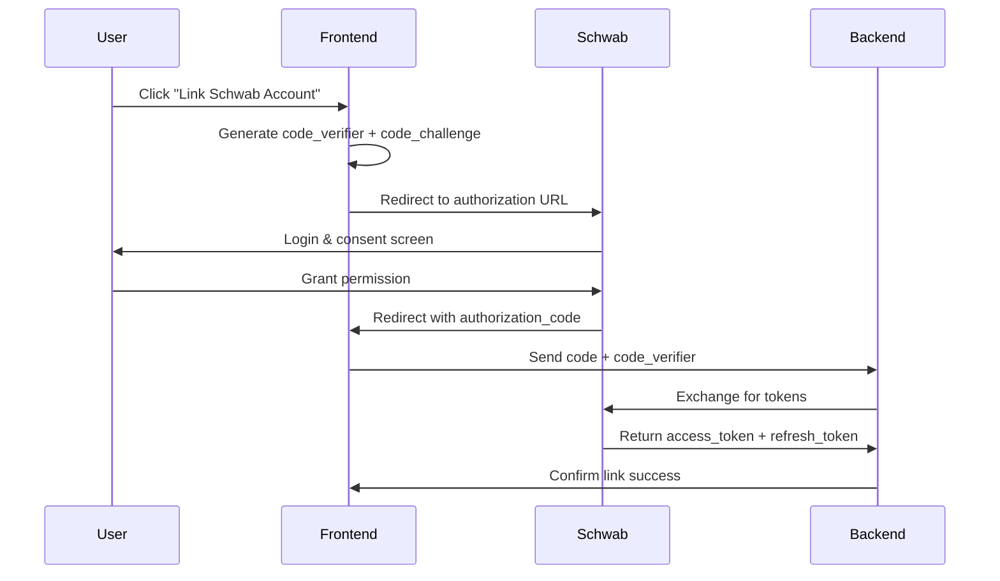
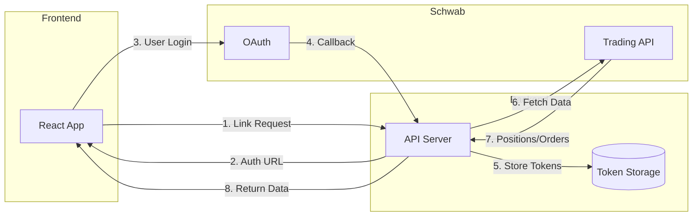

# Schwab API Research: Active Positions Auto-Linking

## Overview

The Charles Schwab Trader API provides programmatic access to account information, positions, orders, and trading capabilities. This research outlines how to integrate Schwab account linking to fetch current position holdings and open stop orders.

---

## API Products Required

When registering an application on the [Schwab Developer Portal](https://developer.schwab.com), select:

| API Product | Purpose |
|-------------|---------|
| **Accounts and Trading Production** | Access positions, balances, orders, and execute trades |
| **Market Data Production** | Current quotes, historical data (optional for this feature) |

---

## Authentication: OAuth 2.0 Flow

Schwab uses a **three-legged OAuth 2.0** workflow with PKCE support for web applications.

### Key Credentials
- **Client ID** (App Key): Public identifier for your app
- **Client Secret**: Keep secure, only used in backend
- **Callback URL**: Must be HTTPS (e.g., `https://your-domain.com/callback`)

### Token Lifecycle
| Token Type | Expiration | Notes |
|------------|------------|-------|
| Access Token | **30 minutes** | Used for API requests |
| Refresh Token | **7 days** | Used to obtain new access tokens |

> [!CAUTION]
> Users must re-authenticate every 7 days when the refresh token expires. There is no way to extend this.

### OAuth Flow for Web App (PKCE)



### Authorization URL Parameters

```
https://api.schwabapi.com/v1/oauth/authorize?
  client_id={CLIENT_ID}
  &redirect_uri={CALLBACK_URL}
  &response_type=code
  &scope=readonly  (or read-write for trading)
  &code_challenge={CODE_CHALLENGE}
  &code_challenge_method=S256
```

### Token Exchange (Backend)

```bash
POST https://api.schwabapi.com/v1/oauth/token
Content-Type: application/x-www-form-urlencoded
Authorization: Basic {base64(client_id:client_secret)}

grant_type=authorization_code
&code={AUTHORIZATION_CODE}
&redirect_uri={CALLBACK_URL}
&code_verifier={CODE_VERIFIER}
```

---

## API Endpoints for Active Positions Feature

### 1. Get Account Numbers/Hashes

Before accessing positions, retrieve the encrypted account hash:

```
GET /trader/v1/accounts/accountNumbers
Authorization: Bearer {access_token}
```

**Response:**
```json
[
  {
    "accountNumber": "12345678",
    "hashValue": "ENCRYPTED_HASH_1234"
  }
]
```

### 2. Get Account Positions

```
GET /trader/v1/accounts/{accountHash}?fields=positions
Authorization: Bearer {access_token}
```

**Response Structure:**
```json
{
  "securitiesAccount": {
    "accountId": "12345678",
    "type": "MARGIN",
    "positions": [
      {
        "shortQuantity": 0,
        "averagePrice": 150.25,
        "currentDayProfitLoss": 125.50,
        "currentDayProfitLossPercentage": 0.83,
        "longQuantity": 100,
        "settledLongQuantity": 100,
        "instrument": {
          "assetType": "EQUITY",
          "cusip": "037833100",
          "symbol": "AAPL",
          "description": "APPLE INC"
        },
        "marketValue": 15250.00
      }
    ],
    "currentBalances": {
      "availableFunds": 25000.00,
      "buyingPower": 50000.00
    }
  }
}
```

### 3. Get Open Orders (Including Stop Orders)

```
GET /trader/v1/accounts/{accountHash}/orders
  ?fromEnteredTime={ISO_DATE}
  &toEnteredTime={ISO_DATE}
  &status=WORKING (optional)
Authorization: Bearer {access_token}
```

**Query Parameters:**
| Parameter | Description |
|-----------|-------------|
| `fromEnteredTime` | Start date (within 60 days of today) |
| `toEnteredTime` | End date |
| `status` | Filter by status: `WORKING`, `FILLED`, `CANCELED`, etc. |
| `maxResults` | Limit number of orders returned |

**Order Statuses for Stop Orders:**
| Status | Meaning |
|--------|---------|
| `AWAITING_STOP_CONDITION` | Stop order waiting for trigger price |
| `WORKING` | Order is active in market |
| `FILLED` | Order executed |
| `CANCELED` | Order was canceled |

**Important Note (Market Hours vs Stop Existence):**
- Stop orders may appear as `AWAITING_STOP_CONDITION` outside regular market hours.
- A stop order still **exists** (and should be treated as risk protection) even if it cannot execute while the market is closed.
- Do not rely on market-open time to decide whether a stop order “counts”.

**Stop Order Response Example:**
```json
{
  "orderId": 1234567890,
  "orderType": "STOP",
  "stopPrice": 145.00,
  "status": "AWAITING_STOP_CONDITION",
  "filledQuantity": 0,
  "remainingQuantity": 100,
  "orderLegCollection": [
    {
      "instruction": "SELL",
      "quantity": 100,
      "instrument": {
        "symbol": "AAPL",
        "assetType": "EQUITY"
      }
    }
  ],
  "enteredTime": "2026-01-26T10:30:00+0000"
}
```

**Order Types:**
- `STOP` - Becomes market order when stop price hit
- `STOP_LIMIT` - Becomes limit order when stop price hit
- `TRAILING_STOP` - Dynamic stop that follows price

---

## Implementation Architecture

### Option A: Backend Proxy (Recommended)



**Pros:**
- Client secret stays secure on backend
- Can implement token refresh automatically
- Better security for user data

### Option B: Direct Frontend (PKCE Only)

For simpler implementations without a backend, use PKCE flow entirely in the browser.

> [!WARNING]
> This approach has limitations:
> - Cannot securely store refresh tokens
> - Users must re-authenticate more frequently
> - Some API calls may be CORS-blocked

---

## JavaScript/TypeScript Libraries

### Unofficial npm Package

```bash
npm install @sudowealth/schwab-api
```

```typescript
import { SchwabClient } from '@sudowealth/schwab-api';

const client = new SchwabClient({
  clientId: process.env.SCHWAB_CLIENT_ID,
  clientSecret: process.env.SCHWAB_CLIENT_SECRET,
  redirectUri: 'https://your-app.com/callback'
});

// Get authorization URL
const authUrl = client.getAuthorizationUrl();

// Exchange code for tokens
const tokens = await client.exchangeCode(authorizationCode);

// Get positions
const accounts = await client.getAccounts({ fields: 'positions' });

// Get open orders
const orders = await client.getOrdersForAccount(accountHash, {
  status: 'WORKING',
  fromEnteredTime: new Date(Date.now() - 60 * 24 * 60 * 60 * 1000) // 60 days ago
});
```

---

## Data Mapping for Trade Analysis App

### Position to Trade Model Mapping

| Schwab Position Field | Trade Analysis Field | Notes |
|-----------------------|----------------------|-------|
| `instrument.symbol` | `Trade.symbol` | Ticker symbol |
| `instrument.assetType` | `Trade.instrumentType` | EQUITY, OPTION, etc. |
| `averagePrice` | `RiskContract.entryPrice` | Entry price for contract |
| `longQuantity` | `RiskContract.shares` + `direction: 'long'` | For long positions |
| `shortQuantity` | `RiskContract.shares` + `direction: 'short'` | For short positions |
| `marketValue` | Display only | Current value (for UI) |

**Unsupported Instrument Detection:**
- `assetType: 'OPTION'` → Check if multi-leg (complex) → Mark as `isSupported: false`
- `assetType: 'FUTURE'` → Mark as `isSupported: false`
- Complex derivatives → Mark as `isSupported: false`, `instrumentType: 'UNSUPPORTED'`

### Stop Order to Stop Loss Mapping

| Schwab Order Field | Trade Analysis Field | Notes |
|--------------------|----------------------|-------|
| `stopPrice` | Effective Stop (for risk calc) | Use as `contractStop` or structure stop |
| `orderType` | Display only | STOP, STOP_LIMIT, TRAILING |
| `remainingQuantity` | Shares with stop | Match to position by symbol |
| `status: 'AWAITING_STOP_CONDITION'` | Active stop order | Include in sync |

**Stop Order Matching:**
- Match stop orders to positions by `symbol`
- If multiple stop orders exist for same symbol, use most recent or aggregate
- If no stop order exists → Mark as "No Stop" / "Unprotected" in UI

### Risk Calculation from Synced Data

**For Supported Positions (EQUITY with STOP/STOP_LIMIT orders):**
```
Position Risk ($) = shares × |entryPrice - stopPrice|
Portfolio Risk ($) = Σ(Position Risk)
Portfolio Risk (%) = Portfolio Risk ($) / Account Size
```

**For Unsupported Positions:**
- Exclude from risk totals OR mark as "Unknown Risk"
- Display "Unsupported" badge in UI
- Show tooltip: "Multi-leg options and complex instruments are not supported yet"

---

## Implementation Plan: Minimal-Effort Auto-Sync Route

### Architecture Decision: Backend Proxy (Required)

**Why Backend is Required:**
- Client secret must be stored securely (cannot be in frontend)
- Refresh tokens need secure server-side storage
- OAuth token exchange requires server-side handling

**Minimal Implementation Approach:**
- Single unified sync endpoint: `POST /api/schwab/sync.ts`
- On-demand sync (page load + polling while user active)
- No background workers or cron jobs
- Simple token refresh on-demand (check expiry, refresh if needed)

### Implementation Milestones

See `doc/task.md` Phase 5 for detailed milestone breakdown:

**Milestone 5.1**: Backend Infrastructure Setup
- Vercel serverless functions structure
- Token storage in Firestore (encrypted)
- Environment configuration

**Milestone 5.2**: OAuth Flow Implementation
- Frontend OAuth initiation (PKCE)
- Backend token exchange
- Token refresh logic

**Milestone 5.3**: Data Sync & Mapping
- Account discovery
- Position fetching
- Stop order fetching
- Instrument type detection (unsupported labeling)

**Milestone 5.4**: Risk Calculation & UI Integration
- Risk snapshot service
- Frontend sync integration
- UI updates for synced positions
- Error handling

**Milestone 5.5**: Testing & Documentation
- Unit tests
- Integration tests
- Documentation updates

### Implementation Checklist

**Prerequisites:**
- [ ] Register app on Schwab Developer Portal
- [ ] Configure callback URL (HTTPS required)
- [ ] Wait for app approval (may take 2-5 business days)
- [ ] Obtain Client ID and Client Secret

**Backend Setup:**
- [ ] Create `/api/auth/schwab/callback.ts` - OAuth callback handler
- [ ] Create `/api/auth/schwab/token.ts` - Token refresh endpoint
- [ ] Create `/api/schwab/sync.ts` - Unified sync endpoint
- [ ] Implement token storage in Firestore (encrypted)
- [ ] Configure Vercel environment variables

**Frontend Integration:**
- [ ] Implement OAuth flow (PKCE for frontend)
- [ ] Add "Link Schwab Account" CTA
- [ ] Build OAuth callback page handler
- [ ] Add sync button/auto-sync on Active Positions page
- [ ] Implement polling mechanism (2-5 min intervals)

**Data Processing:**
- [ ] Build position fetching endpoint
- [ ] Build orders fetching with stop filter
- [ ] Map Schwab data to Trade Analysis models
- [ ] Detect and label unsupported instruments
- [ ] Calculate risk from synced positions

**Error Handling:**
- [ ] Handle 7-day re-authentication requirement (show prompt)
- [ ] Handle token refresh failures
- [ ] Add error handling for API failures
- [ ] Handle rate limits gracefully

---

## Limitations & Considerations

| Issue | Impact | Mitigation |
|-------|--------|------------|
| 7-day refresh token expiry | User must re-login weekly | Show reminder before expiry |
| 30-min access token expiry | Need automatic refresh | Implement proactive refresh |
| App approval delay | 2-5 business days | Plan timeline accordingly |
| Rate limits | TBD (not well documented) | Implement request queuing |
| Only 60 days of order history | Can't fetch older orders | Cache historical data locally |

---

## Next Steps

### Immediate Actions
1. **Create Schwab Developer Account** at [developer.schwab.com](https://developer.schwab.com)
2. **Register Application** with "Accounts and Trading Production" API
3. **Wait for Approval** (typically 2-5 business days) - **Start this early as it's blocking**

### Development Sequence
1. **Set up backend infrastructure** (Milestone 5.1)
   - Create Vercel serverless functions structure
   - Design token storage schema
   - Configure environment variables

2. **Implement OAuth flow** (Milestone 5.2)
   - Frontend OAuth initiation
   - Backend token exchange
   - Token refresh logic

3. **Build sync endpoints** (Milestone 5.3)
   - Account discovery
   - Position + order fetching
   - Data mapping and unsupported detection

4. **Integrate with UI** (Milestone 5.4)
   - Risk calculation service
   - Frontend sync integration
   - UI updates and error handling

5. **Testing & polish** (Milestone 5.5)
   - Unit and integration tests
   - Documentation updates

**See `doc/task.md` Phase 5 for detailed milestone breakdown and checkboxes.**

---

## References

- [Schwab Developer Portal](https://developer.schwab.com)
- [schwab-py Documentation](https://schwab-py.readthedocs.io/en/latest/)
- [OAuth 2.0 PKCE Flow](https://oauth.net/2/pkce/)
- [npm: @sudowealth/schwab-api](https://www.npmjs.com/package/@sudowealth/schwab-api)
